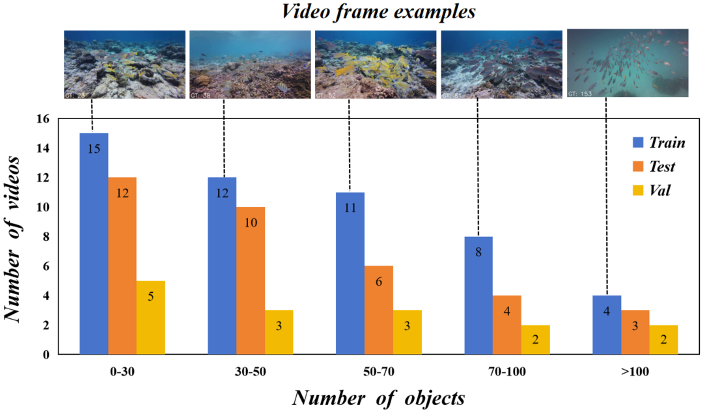

# SVIMOC-Net
SVIMOC-Net: Semi-Supervised Learning for Video Indiscernible Marine Object Counting with First-Frame-Only Annotation

## Setup
Pytorch 1.10.2

Python 3.8.19

## Dataset preparation 
We construct a new dataset, termed VIMOC-1F, which contains 50 high-definition fish videos, with each 10th frame annotated, resulting in approximately 40, 800 annotated points in total.

  

## Pre-train models
You can download the model weights we provided [here](https://drive.google.com/file/d/1IyTw042-mxeBfazlvnUxb4wUnPtdA8Lj/view?usp=drive_link)
